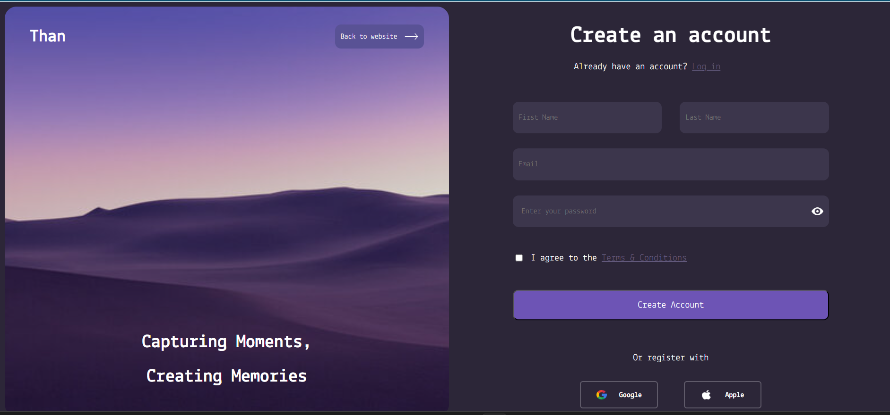

## Signup Form
A simple signup form.
## Result

## Key Accomplishments and Features:

- Split-Screen Layout:
    - Implemented a visually appealing split-screen design, dividing the page into two distinct sections (left and right).
    - Utilized flexbox to create a flexible and responsive layout that adapts to different screen sizes.
- Semantic HTML:
    - Employed semantic HTML5 elements (`<section>, <header>, <footer>, <form>, <button>`) to structure the page, enhancing accessibility and maintainability.
- Form Functionality:
    - Created a fully functional sign-up form with input fields for first name, last name, email, and password.
    - Implemented a "show password" toggle using JavaScript to enhance user experience.
    - Form includes a checkbox for terms and conditions.
    - Form has a submit button.
- Third-Party Registration Options:
    - Included options to register using Google and Apple accounts, providing users with alternative sign-up methods.
- Visual Design and Styling:
    - Used a cohesive color scheme with a dark background and white text.
    - Applied custom fonts from Google Fonts to enhance typography.
    - Added hover effects to buttons and registration options for improved interactivity.
    - Used a background image for the left screen.
- JavaScript Functionality:
    - Working password toggle function.
- Responsive Design Foundations:
    - Made a base for responsive design using flexbox.

## Improvements

* Responsiveness: Add media queries to fully support mobile devices.
* Form Validation: Implement JavaScript form validation to enhance user experience.
* Accessibility: Add ARIA attributes and improve color contrast for better accessibility.
* Code Refactoring: Refactor CSS for better organization and maintainability.
* Error Handling: Add error messages for user input.